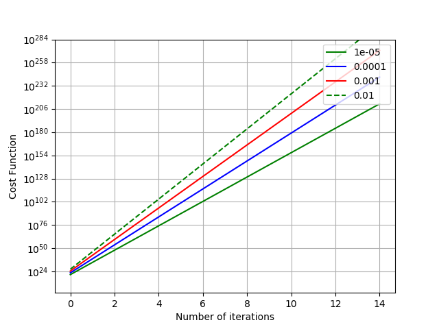
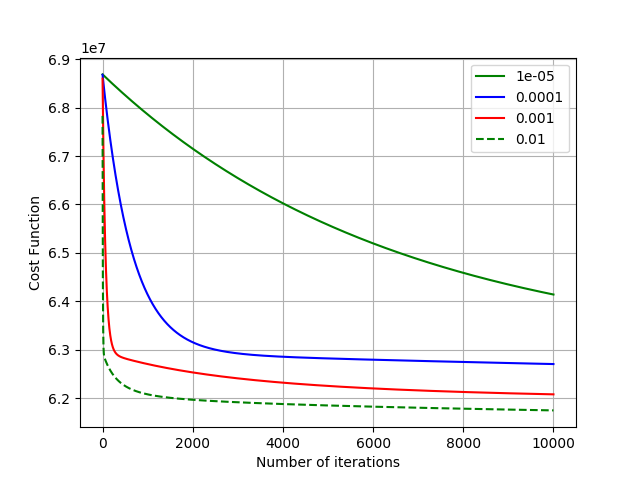
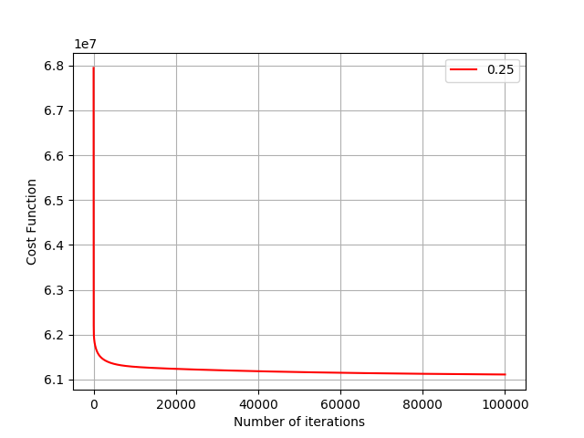
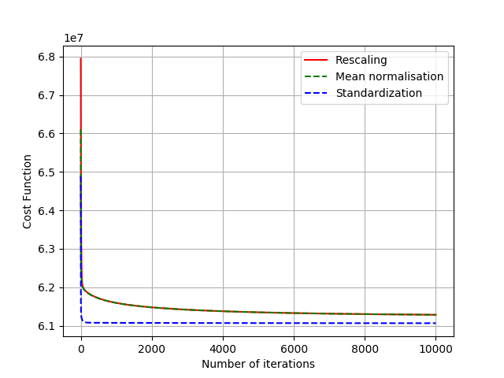
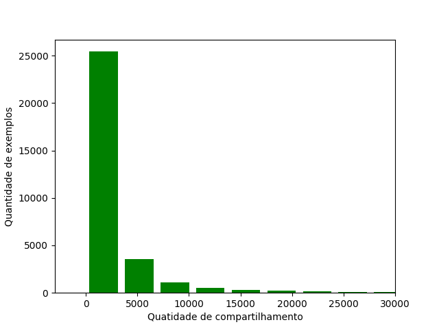

# Linear Regression to predict Online News Popularity

For more information, read Report.pdf (in Portuguese) or contact me.

### Atividades

* Preparation and loading of the dataset and implementation of LR;
* Feature scaling and Feature Selection;
* Removal of noise and changes in Target.

## LR implementation

gradient_descent, normal_equation cost_function, fit, predict, rmse e r2_score.

  

## Feature scaling
Rescaling, Mean normalisation, Standardization. 

  

  

  

## Remoção de ruídos

Uma etapa importante para alguns algoritmos de Machine Learning (ML) é a limpeza dos dados, ou seja, a remoção de exemplos que não corresponde a realidade ou que representam um condição anormal. Nem sempre é possível saber se um dado é ou não de fato um ruido.

Neste experimento, foram considerados possíveis ruídos valores que são extremamente grandes ou pequenos, quando comparado com os demais exemplos para um determinado feature.

Esses exemplos possivelmente ruidosos foram encontrados por feature e removidos. Após a remoção de cada conjunto de exemplos, foi verificado se o modelo ficou melhor ou pior. Todos aqueles exemplos que estavam atrapalhando o modelo foram removidos do conjunto de treinamento.

Ao fim desse processo, a função de custo caiu para  5*10^7 , o RMSE caiu para  8*10^3. No total foram removidas aproximadamente 1000 exemplos do treinamento.

## Feature Selection

O próximo passo consiste na exploração de feature selection. Este processo seleciona automaticamente os features que mais contribuem para a variável de previsão ou saída de interessado. Foram explorados o Univariate Selection (UC), Recursive Feature Elimination (RFE) e Principal Component Analysis (PCA).   

A UC pode ser utilizada para selecionar os recursos que têm a relação mais forte com a variável de saída. Para realizar este processo a biblioteca scikit-learn fornece a classe SelectKBest que pode ser usada com um conjunto de testes estatísticos para selecionar um número específico de recursos. Foi utilizado o teste estatístico qui-quadrado ( chi^2 ) para recursos não negativos. O melhor modelo encontrado com esta técnica coincide com o modelo anterior (mesma quantidade de features, mesma precisão e mesmo valor na função de custo).

O RFE funciona removendo recursivamente os atributos e construindo um modelo nos atributos que permanecem. Ele usa a precisão do modelo para identificar quais atributos (e combinação de atributos) contribuem mais para prever o atributo de destino. O melhor modelo encontrado com esse método consiste de um subconjunto com 31 features, que após treinamento obteve função de custo com o valor  5.5*10^7 e RMSE com valor de  7.8*10^3.

O PCA usa álgebra linear para transformar o conjunto de dados em uma forma compactada. O melhor modelo encontrado com esse método consiste de um subconjunto com 54 features, que após treinamento possui função de custo com o valor  5.5*10^7 e RMSE com valor de  7.8*10^3.

O melhor modelo entre os 3, foi utilizando a eliminação RFE, como pode ser visto na Tabela abaixo.

| UC | RFE | PCA 
--- | --- | --- |
| Num. features   |  58       |  31           |  54 | 
| Função de custo |  5*10^7   |  5.5*10^7     |  5.5*10^7 |  
| RMSE            |  8*10^3   |  7.8*10^3     |  7.8*10^3 |  

## Alterações no target

Para tentar melhorar o modelo, o valor de shares foi transformado para uma escala logarítmica (log, log2, log10) antes de fazer o treinamento. Isso melhorou bastante a função de custo, que ficou compreendida entre 0 e 1. No entanto, a fazer a operação reversa para voltar ao numero de shares originais (aplicando a exponenciação, base ^ {log_base (found_shares) ) o RMSE piorou, então este experimento foi descartado.

Uma outra abordagem utilizada foi a remoção de outlier. Este pode ser definido como sendo um valor que apresenta um grande afastamento dos demais da série. 

Similarmente ao que foi feito com a remoção de ruido dos features, aqui foram removidos os outliers dos exemplo onde o valor é maior que sua média mais ou menos dois desvios padrão, pois como pode ser visto na figura abaixo muitos poucos exemplos possuem valores acima de 25 mil. 

  

Após essa remoção, tem se um modelo um pouco melhor: função de custo igual a  5*10^6 e RMSE igual a  3.2*10^3.

## Normal Equation

Após se obter o melhor modelo possível utilizando o Gradient Descent (GD) para calcular os valores dos tetas, também foi utilizado o Normal Equation (NE) que calcula os tetas de forma algébrica.

Apesar de o NE não ser recomendado para grande quantidade de exemplos, foram utilizados todos os exemplos do conjunto de treinamento para realizar o calculo.

Com os tetas encontrados, foi calculado o valor da função de custo, e do RMSE, onde foi encontrado aproximadamente o mesmos valores. Para este modelo treinado, o uso do GD com os parâmetros mencionado anteriormente é equivalente ao NE.

## Regularização

A regularização foi implementada tanto no GD quanto no NE, porém não estava sendo utilizada no modelo (lambda igual a zero) até o modelo final. Fazendo os testes para diferentes lambadas, o melhor modelo encontrado foi com o lambda igual a zero, ou seja, sem usar a regularização.

## Conclusão e Trabalhos Futuros

A aplicação da RL para esse dataset não obteve um bom modelo, pois ao fazer o teste final (com o arquivo de test) o RMSE foi de aproximadamente 3.5*10^3, o que representa o erro grande dos valores preditos em comparação aos targets.

Ainda tem muito o que pode ser melhorado nesse modelo para a aplicação da RL, como exemplos de trabalhos futuros, aplicação de técnica de detecção de outliers, pois a remoção de ruído foi baseada em testes manuais e observações. 

Outra possibilidade seria fazer a combinação dos melhores features (aqueles encontrados com o REF neste trabalho, por exemplo) e gerar mais features a parti de combinação destes melhores, pois, como não foi percebido praticamente nenhum overfitting, pode significar que o modelo não foi ajustado corretamente.

Uma predição com menos erros e com mais precisão também poderia ser explorada com a utilização de outras técnicas ou cominações de técnicas de ML.
